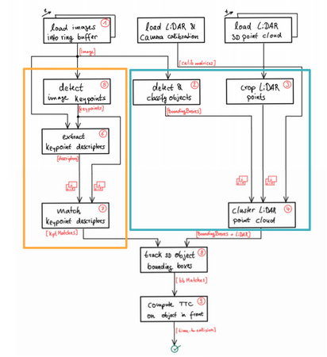
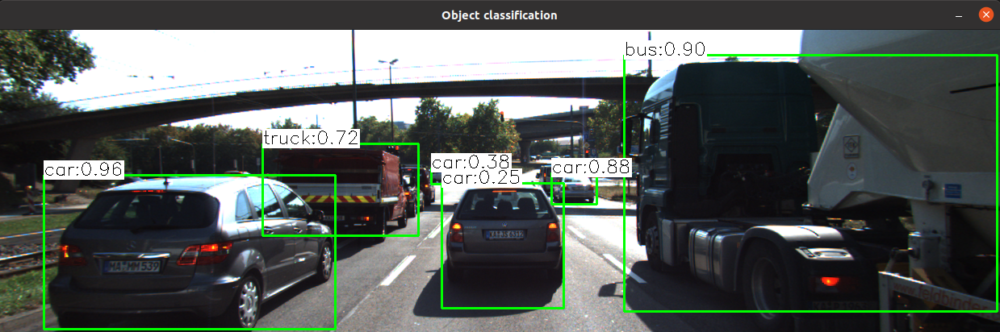
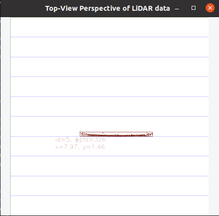
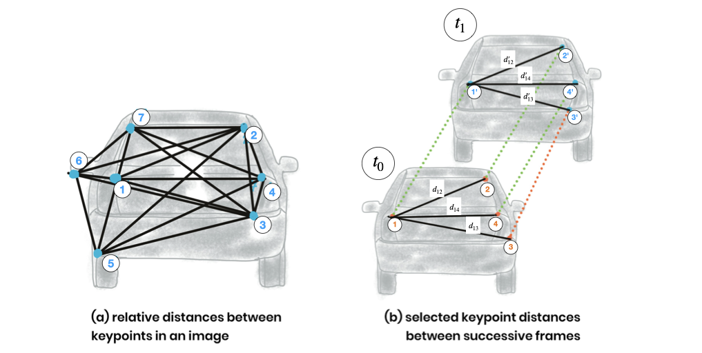
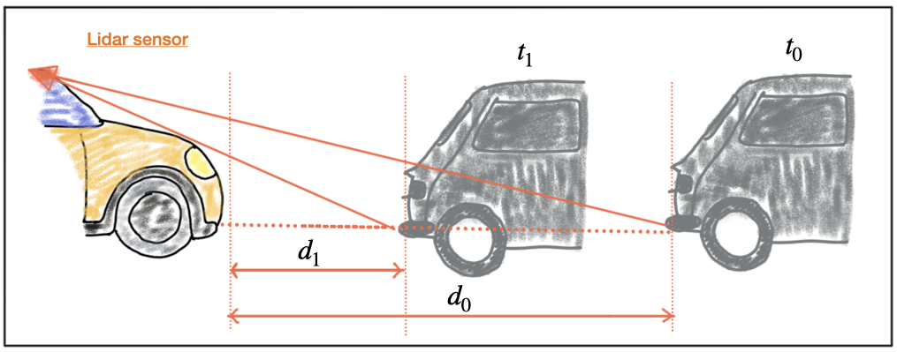
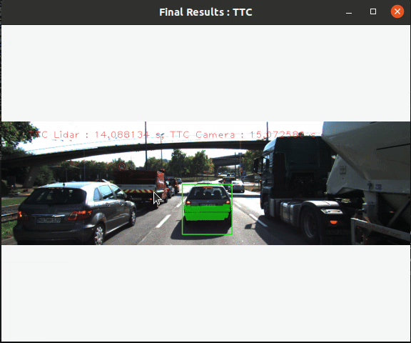

# Time_2_Collision

## 1. Introduction

This project is part of the Sensor Fusion Nanodegree at Udacity. The goal is to detect and track 3D objects using a combination of camera and LiDAR data, then calculate the Time to Collision (TTC) for each object in the ego lane using camera and LiDAR data separately. Calculating TTC is crucial for collision avoidance in autonomous driving, where precise timing can prevent accidents.

The steps followed in the project are illustrated in the flow diagram below:



## 2. 2D Object Detection using YOLO v3

The first part of the project involves detecting objects in the camera image using YOLO v3, a state-of-the-art deep learning algorithm for real-time object detection. The pretrained model is loaded using the `cv2.dnn.readNet` function. Detected bounding boxes are filtered based on confidence scores, and Non-Maximum Suppression (NMS) is applied to remove overlapping boxes. The output of the YOLO detector is shown below:



*Figure: Output of YOLO v3 object detection*

## 3. LiDAR Point Cloud Processing

The LiDAR point cloud data is processed to detect objects within the ego lane. Point cloud data represents the environment in 3D by capturing points in space. The data is first filtered to remove points outside the ego lane. Then, the 3D LiDAR points are projected onto the image plane using the camera projection matrix, aligning the LiDAR data with the camera image. Points within the bounding boxes of detected objects are then clustered together. Below is a top view of the clustered LiDAR points within the ego lane:



*Figure: Top view of clustered LiDAR points in the ego lane. The points are shown only for the rear part of the vehicle in the ego lane.*

## 4. Tracking 2D Bounding Boxes

The 2D bounding boxes detected using YOLO are tracked across frames using a keypoint matching method. Keypoints are detected using the Shi-Tomasi corner detection algorithm, and descriptors are calculated using the BRISK algorithm. Keypoints are matched between consecutive frames using the Brute-Force matcher. The bounding box in the next frame is tracked based on the number of matched keypoints.

Users can choose from several keypoint detection algorithms: Shi-Tomasi, Harris, FAST, BRISK, ORB, and SIFT. Descriptor calculation options include BRISK, ORB, FAST, and SIFT. For keypoint matching, Brute Force and FLANN matching are implemented, with options for Nearest Neighbour and k-Nearest Neighbour matching.

## 5. Tracking 3D Objects

The 2D bounding boxes are tracked as explained above. The 3D points projected to the image plane and within the tracked 2D bounding box are considered part of the tracked 3D object.

## 6. Calculating Time to Collision (TTC)

With the tracked 3D objects in the ego lane and 2D bounding boxes in the camera image, the Time to Collision (TTC) can be calculated using the camera and LiDAR data separately.

### **TTC Calculation using Camera Data**
The TTC for camera data is calculated using the following formula:

```
TTC = -dT / (1 - median(dist_ratios between keypoints of consecutive frames))
```

This method is illustrated below:



*Figure: Illustration of TTC calculation using camera data*

### **TTC Calculation using LiDAR Data**
The TTC for LiDAR data is calculated using the following formula:


```
TTC = -dT * d1 / (d0 - d1) 
```

Where:
- `d0` and `d1` are the minimum distances between the ego vehicle and the object in the previous and current frames, respectively.
- `dT` is the time elapsed between the frames.

This method is illustrated below:



*Figure: Illustration of TTC calculation using LiDAR data*

## 7. Installation

To set up the project, follow these steps:

```bash
# Clone the repository
git clone https://github.com/your-repository-link
cd Time_2_Collision

# Download YOLO weights
wget -O data/yolov3.weights https://pjreddie.com/media/files/yolov3.weights

# Build the project
mkdir build && cd build
cmake ..
make

# Run the executable
./3D_object_tracking
```

## 3. Results

The results of the TTC estimated using camera data and LiDAR data are shown in the video below:



*Figure: Results of TTC estimation using camera and LiDAR data*

## 4. Conclusion

The project demonstrates the use of camera and LiDAR data to detect and track 3D objects in the ego lane. The TTC is calculated using camera data and LiDAR data separately. The results show that the TTC calculated using camera data and LiDAR data separately are not consistent with each other. Sometimes the TTC calculated were way off from the expected value. The results can be improved by using a more robust sensor fusion algorithm such as Kalman filter or Unscented Kalman filter.
