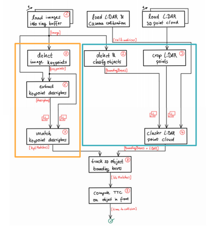
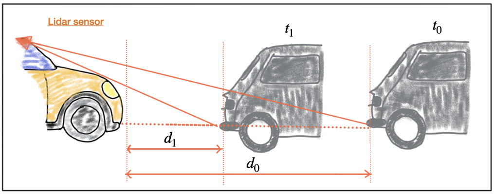
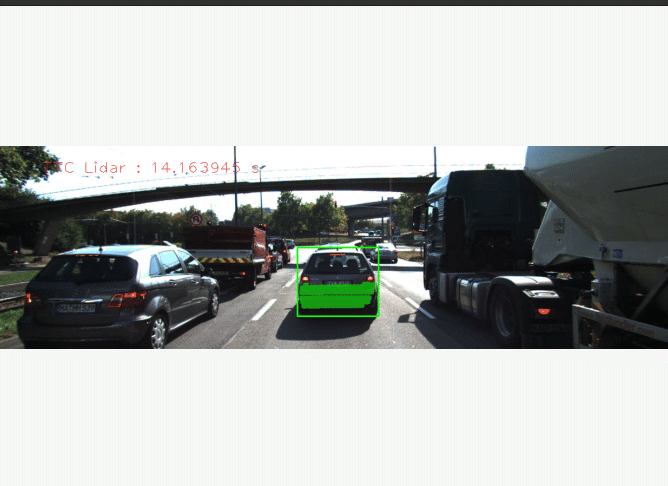

# Time_2_Collision

## 1. Introduction

This project is part of the Sensor Fusion Nanodegree at Udacity. The goal is to detect and track 3D objects using a combination of camera and LiDAR data, then calculate the Time to Collision (TTC) with the nearest object in the ego lane. The primary aim of this project was to finish the week 2 assignmnet of Sensor Fusion Nanodegree at Udacity, as well as using techniques to acclerate the inference speed of YOLO v8 in C++ & CPU deployment. 

The steps followed in the project are illustrated in the flow diagram below:



## 2. 2D Object Detection using YOLO v8

The first step of this project involves detecting objects in camera images using YOLOv8. To enhance inference speed on CPU-based systems, I integrated YOLOv8 with OpenVINO and applied static INT8 quantization. Additionally, the implementation allows switching between ONNX Runtime and OpenCV::DNN via command-line arguments.

Before finalizing OpenVINO for inference, I explored multiple deployment options, including OpenCV-DNN, ONNX Runtime, and OpenVINO, for running YOLOv8 in C++ on a CPU. The code for model quantization, along with benchmarking results comparing ONNX Runtime, OpenVINO, and OpenCV’s DNN module, is available [here](https://github.com/arunmadhusud/Fast_YOLOv8_CPP)

## 3. LiDAR Point Cloud Processing

The LiDAR point cloud data is processed to detect objects within the ego lane. First, points outside the ego lane are filtered out. The remaining 3D points are then projected onto the image plane using the camera projection matrix, aligning the LiDAR data with the camera image. Finally, points within the bounding boxes of detected objects are clustered together for further analysis.

## 4. Tracking Objects in 3D

YOLO-detected 2D bounding boxes are tracked across frames using keypoint matching. Keypoints are detected with the Shi-Tomasi corner detector, and descriptors are extracted using the BRISK algorithm. The Brute-Force matcher is then used to match keypoints between consecutive frames. The bounding box in the next frame is identified based on the number of matched keypoints, and the corresponding 3D points within the tracked 2D bounding box are associated with the tracked 3D object.

## 5. Calculating Time to Collision (TTC)

With the tracked 3D objects in the ego lane, the Time to Collision (TTC) can be calculated using the following formula:


```
TTC = -dT * d1 / (d0 - d1) 
```

Where:
- `d0` and `d1` are the minimum distances between the ego vehicle and the object in the previous and current frames, respectively.
- `dT` is the time elapsed between the frames.

This method is illustrated below:



*Figure: Illustration of TTC calculation using LiDAR data*

## 6. Installation


Generate the yolov8 weights file using the instrunctions given in the [repository](https://github.com/arunmadhusud/Fast_YOLOv8_CPP) and place the weights file in the dat folder. The folder structure should look like this:

```bash
Time_2_Collision
  - data
    - yolov8n_int8.xml # OpenVINO IR file
    - yolov8n_int8.bin # OpenVINO IR file
    - yolov8n_st_quant.onnx # ONNX model file
```

Run the following commands to build the project:

```bash
# Clone the repository
git clone https://github.com/arunmadhusud/Time_2_collision
cd Time_2_Collision

# Build the project
mkdir build && cd build
cmake ..
make

# Run the executable
./3D_object_tracking 
```

## 3. Results

The results of the TTC estimated using camera data and LiDAR data are shown in the video below:



*Figure: Results of TTC estimation using camera and LiDAR data*


