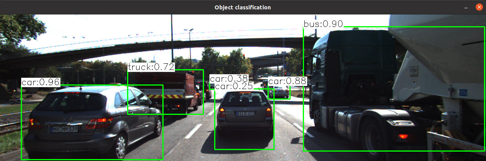
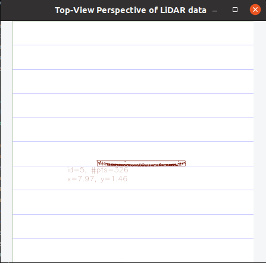

# Time_2_Collision

## 1. Introduction

This project is part of the Sensor Fusion Nanodegree at Udacity. The goal is to detect and track 3D objects using a combination of camera and LiDAR data, then calculate the Time to Collision (TTC) for each object in the ego lane using camera and LiDAR data. Calculating TTC is crucial for collision avoidance in autonomous driving, where precise timing can prevent accidents.

The steps followed in the project are illustrated in the flow diagram below:


## 2. 2D Object Detection using YOLO v8

The first step of the project involves detecting objects in camera images using YOLO v8. To improve inference speed on CPU-based systems, I integrated YOLOv8 with OpenVINO and applied static INT8 quantization. Additionally, you can switch between ONNX Runtime or OpenCV::DNN by passing command-line arguments.

Before finalizing this inference method, I explored various options, including OpenCV-DNN, ONNX Runtime, and OpenVINO, for deploying YOLOv8 in C++ on CPU. The code for model quantization, along with benchmarking details for using ONNX Runtime, OpenVINO, and OpenCV’s DNN module, is available [here](https://github.com/arunmadhusud/Fast_YOLOv8_CPP)


*Figure: Output of YOLO v8 object detection*

## 3. LiDAR Point Cloud Processing

The LiDAR point cloud data is processed to detect objects within the ego lane. Point cloud data represents the environment in 3D by capturing points in space. The data is first filtered to remove points outside the ego lane. Then, the 3D LiDAR points are projected onto the image plane using the camera projection matrix, aligning the LiDAR data with the camera image. Points within the bounding boxes of detected objects are then clustered together. Below is a top view of the clustered LiDAR points within the ego lane:



*Figure: Top view of clustered LiDAR points in the ego lane. The points are shown only for the rear part of the vehicle in the ego lane.*

## 4. Tracking Objects in 3D

The 3D points projected onto the image plane, the 2D bounding boxes detected by YOLO, and the LiDAR points within a bounding box are considered as part of the same object. The YOLO-detected 2D bounding boxes are tracked across frames using keypoint matching. Keypoints are found with the Shi-Tomasi corner detector, and descriptors are created with the BRISK algorithm. The Brute-Force matcher is then used to match keypoints between consecutive frames. The bounding box in the next frame is tracked based on the number of matched keypoints, and the 3D points within the tracked 2D bounding box are linked to the tracked 3D object.

## 5. Calculating Time to Collision (TTC)

With the tracked 3D objects in the ego lane and 2D bounding boxes in the camera image, the Time to Collision (TTC) can be calculated using the camera and LiDAR data .

The TTC for LiDAR data is calculated using the following formula:


```
TTC = -dT * d1 / (d0 - d1) 
```

Where:
- `d0` and `d1` are the minimum distances between the ego vehicle and the object in the previous and current frames, respectively.
- `dT` is the time elapsed between the frames.

This method is illustrated below:


*Figure: Illustration of TTC calculation using LiDAR data*

## 6. Installation


Generate the yolov8 weights file using the instrunctions given in the [repository](https://github.com/arunmadhusud/Fast_YOLOv8_CPP) and place the weights file in the dat folder. The folder structure should look like this:
```bash
Time_2_Collision
  - data
    - yolov8n_int8.xml # OpenVINO IR file
    - yolov8n_int8.bin # OpenVINO IR file
    - yolov8n_st_quant.onnx # ONNX model file
'''

Run the following commands to build the project:

```bash
# Clone the repository
git clone https://github.com/your-repository-link
cd Time_2_Collision

# Build the project
mkdir build && cd build
cmake ..
make

# Run the executable
./3D_object_tracking [cvdnn|onnx|openvino]
```

## 3. Results

The results of the TTC estimated using camera data and LiDAR data are shown in the video below:


*Figure: Results of TTC estimation using camera and LiDAR data*


